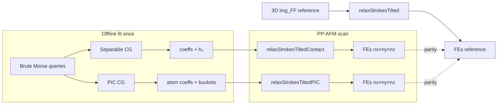

# AFM Contact Surface — Static (Rigid Sample, Classical FF)

**Status:** Prototype implemented and wired to `AFMulator`  
**Scope:** Memory-efficient **field representation** for rigid classical AFM (Morse/LJ); evaluated during PP relaxation, not a scan-image format.  
**Pitfalls:** [Takeways.md](../../Takeways.md) · **Module index:** [spammm/surfaces/README.md](../../../spammm/surfaces/README.md)

**Related:** [ContactSurface_Elastic.md](ContactSurface_Elastic.md) · [../../surface_interactions.md](../../surface_interactions.md) · [../../afm_stm_simulation.md](../../afm_stm_simulation.md)

---

## Summary

PP-AFM today precomputes a dense 3D texture (`img_FF`) and samples it each relaxation step.
The contact surface compresses the contact-relevant potential into either:

1. **Separable B-spline × poly** — lateral corrugation on a knot grid × few z-modes above `h₀(x,y)`
2. **Radial PIC** — compact per-atom radial modes summed via particle-in-cell buckets

Both paths share GPU brute Morse reference, matrix-free CG fitting, and `run_scan_*` APIs that
mirror legacy `run_scan` geometry while swapping `interpFE` for `cs_eval_*_fe_at`.



---

## Tutorial — separable and PIC

### Prerequisites

- `AFMulator(use_morse=True)` with molecule loaded and `assign_params()`
- Fit samples at **probe** z (`zmax + offset`), not tip z — see [Takeways § z alignment](../../Takeways.md)

### Separable (recommended first)

```python
afm.fit_contact_surface(
    margin=4.0,
    bspl_dx=0.2,           # B-spline knot spacing [Å] — same grid for h₀ and coeffs
    poly_R=5.0, poly_z0=1.0, m_start=4, nz=6,
    fit_z_adaptive=(1.0, 6.0, 0.1, 1.0),  # z above zmax: lo, hi, dz_lo, dz_hi
    fit_dx=0.2, fit_dy=0.2,
    fit_boltzmann=True,
    fit_force_weight=1.0,  # E + Fx,Fy,Fz with RMS equalization
    n_iter=120,
)
afm.setup_grid(...)       # only if comparing to 3D reference scan
afm.make_forcefield()     # 3D reference only
FEs_cs, _ = afm.run_scan_contact(nxy=(99, 75), nz=25, dtip=-0.15, scan_p0=..., ...)
FEs_3d, _ = afm.run_scan(...)  # parity
```

### PIC (atom-centric)

```python
pic = afm.fit_pic_contact_surface(
    margin=4.0,
    poly_R=5.0, m_start=4, nz=5, cell_size=10.0,
    z_local=1.2, xy_radius=14.0,   # select_contact_atoms
    reg=1e-2,                      # required — 1e-4 diverges
    fit_z_adaptive=(1.0, 6.0, 0.1, 1.0),
    fit_dx=0.2,
    # Boltzmann logged but not applied to PIC CG
)
FEs_pic, _ = afm.run_scan_pic(...)  # relaxStrokesTiltedPIC
```

### Visual review pipeline

```bash
pytest tests/SPM/test_afm_contact_surface.py -q          # L0 GPU
RUN_CONTACT_PP=1 python tests/testplot_contact_surface.py  # L1+L2
```

Artifacts: `debug/testplot_contact_surface/` — fit weights, z-basis, close parity, z-alignment,
`contact_surface_pic_atoms.png`, `pp_afm_parity_Fz_*_relaxed.png`.

---

## API reference

### AFMulator (`spammm/SPM/AFM.py`)

| Method | Role |
|--------|------|
| `fit_contact_surface(...)` | Build `SeparableParams`, brute reference, `fit_separable_cg`, `setup_contact_surface` |
| `setup_contact_surface(sep)` | Upload separable coeffs + h₀ to `_cl` buffers |
| `run_scan_contact(...)` | PP scan via `relaxStrokesTiltedContact` |
| `get_raw_FE_contact(...)` | Unrelaxed FE along scan (diagnostics) |
| `fit_pic_contact_surface(...)` | Build `PICParams`, `fit_pic_cg`, `setup_pic_contact` |
| `setup_pic_contact(pic)` | Upload PIC atoms, buckets, coeffs |
| `run_scan_pic(...)` | PP scan via `relaxStrokesTiltedPIC` |

Shared lazy GPU helper: `_cs_fit_helper()` → `ContactSurfaceCL` (reuse zeros `AtAp` between fits).

### ContactSurfaceCL (`spammm/surfaces/ContactSurface.py`)

| Function / class | Role |
|------------------|------|
| `SeparableParams` | B-spline grid metadata, `h₀`, coeffs layout `ic = ix + ncx*(iy + ncy*kz)` |
| `PICParams` | Contact atom indices, buckets, radial coeffs `nat×nmodes` |
| `select_contact_atoms` | Local z-shell + xy neighborhood filter |
| `build_pic_buckets` | Particle-in-cell atom lists (`cell_size > 2·Rc`) |
| `build_contact_height_map` | Per-knot max atom z within `r_xy` |
| `fit_separable_cg` | Weighted CG + optional force rows |
| `fit_pic_cg` | Unweighted CG + Tikhonov `reg` on diagonal |
| `eval_separable` / `eval_pic` | Point queries → `(E, F)` |
| `eval_pic_grid` | Tiled 16×16 PIC eval on regular xy grid |

### OpenCL kernels (`kernels/contact_surface.cl`)

| Kernel group | Separable | PIC |
|--------------|-----------|-----|
| Brute reference | `cs_brute_plqh_points`, `cs_brute_afm_morse_c_points` | (same reference) |
| Fit operators | `cs_sep_Av`, `cs_sep_Atv`, `cs_sep_Atv_w`, `cs_sep_Av_f`, `cs_sep_Atv_f_w` | `cs_pic_Av`, `cs_pic_Atv`, `cs_pic_Atv_w` |
| Eval | `evalSeparableBsplinePoly`, `cs_eval_separable_fe_at` | `evalRadialPIC`, `cs_pic_eval_tile16`, `cs_eval_pic_fe_at` |
| PP relaxation | `relaxStrokesTiltedContact` (in `contact_surface.cl`) | `relaxStrokesTiltedPIC` |
| CG helpers | `dot_wg`, `addMul`, `cs_zero`, `cs_copy` | shared |

Program build: `common.cl` + `Forces.cl` + `contact_surface.cl` (+ `AFM.cl` when embedded in AFMulator).

---

## Parity status (PTCDA Morse, 2026-07)

| Check | Separable | PIC | Test |
|-------|-----------|-----|------|
| Force stencil vs eval | ✓ < 1e-4 | — | `test_contact_surface_force_stencil_parity` |
| Fit RMSE (E) | ~7 meV | ~28 meV | `testplot_contact_surface` stdout |
| Close E @ z+1.2 Å | ~8 meV | ~32 meV | `contact_surface_close_parity.png` |
| PP relaxed mean Fz RMSE | ~14 meV/Å | ~20 meV/Å | `pp_afm_parity_Fz_*_relaxed.png` |

Fit config: `bspl_dx=0.2 Å`, `poly_R=5 Å`, `poly_z0=1 Å`, adaptive z fit 1–6 Å above `zmax`.
Basis and fit-region tuning still open — current quality is usable, not optimal.

---

## 0. Primary deliverable (read this first)

| | Legacy 3D path | Quasi-2D path (this work) |
|--|----------------|---------------------------|
| **Precompute** | `make_forcefield()` → `img_FF` (nx×ny×nz×float4) | `fit_contact_surface()` → coeffs + h₀ (~ncx×ncy×nz_modes floats) |
| **Relaxation kernel** | `relaxStrokesTilted` + `interpFE(img_FF, pos)` | `relaxStrokesTiltedContact` + `cs_eval_separable_fe_at(pos)` |
| **Scan API** | `run_scan()` | `run_scan_contact()` — **identical scan geometry**, different field evaluator |
| **Validation** | Reference | Relaxed Fz / df images must match 3D within tolerance (`tests/SPM/testplot_afm_contact_surface.py`) |

The whole point: **do PP-AFM without allocating or sampling a dense 3D voxel texture.**

### Curved / envelope scanning (common use case)

For **3D molecules** and **STM-feedback AFM**, the tip does not follow a flat horizontal plane. The scan trajectory is often a **smooth low-frequency envelope** in z:

```
z_tip(x, y) = z_ref + S(x, y)        S smooth (e.g. from STM current feedback)
z_probe = z_tip + offset_bond
```

The quasi-2D model separates:

- **`h(x, y)`** — high-frequency **molecular contact height** (corrugation, B-spline field h₀)
- **`S(x, y)`** — slow scan-surface / feedback envelope (specified per scan pixel in `scan_p0` + lateral grid; can vary z along `(x,y)`)

Interaction uses `dz = max(z_probe − h(x,y), 0)`. The separable form is natural: lateral B-splines capture corrugation; a few z-modes capture the short-range wall above `h`. The feedback envelope is **orthogonal** — it lives in the scan path, not in the fitted coeffs. Future: `scan_p0`/`scan_da`/`scan_db` with per-pixel tip z from `S(x,y)` (tilted or curved strokes).

---

## 1. Problem Statement

### Current bottleneck

The LJ/Morse AFM path precomputes a **3D** potential/force texture and samples it at every PP relaxation step:

```
evalMorseC_QZs_toImg  →  img_FF (nx × ny × nz × float4)   ← FIELD REPRESENTATION (large)
relaxStrokesTilted      →  interpFE(img_FF, pos) per MD step
run_scan                →  nx_scan × ny_scan × nz heights    ← AFM IMAGE OUTPUT (separate)
```

The memory problem is **`img_FF`**, not the scan image. The quasi-2D replacement keeps the same `run_scan` geometry but swaps the middle row for `cs_eval_separable_fe_at(coeffs, h₀, pos)`.

GridFF for substrates has the same scaling (`spammm/surfaces/GridFF.py`, `kernels/gridFF.cl` — tricubic B-spline, 64 neighbor reads per sample).

### What we want

A representation that:

1. Captures the **contact-relevant** part of the potential (repulsive wall + near-contact attraction) with far fewer degrees of freedom.
2. Supports **fast GPU evaluation** during probe-particle dynamics (texture lookup or sparse atom sum).
3. Works for **aperiodic** molecular samples (not just crystal substrates).
4. Serves as the **foundation** for the elastic extension (Phase 2) — same spatial discretization, additional channels later.

### Physical picture (rigid limit)

For a rigid sample, the PP sees a **height map** of the repulsive envelope plus short-range attractive tails. The tip radius provides spatial low-pass filtering. We do not need a full 3D voxel cube if:

- Far from contact, forces are smooth and low-amplitude (vdW tail can be summed over atoms directly, or approximated).
- Near contact, the dominant constraint is **where** the repulsive wall is in (x,y) and **how steep** it is in z.

This is the quasi-2D **contact surface** abstraction: compress the z dimension into a small number of decay modes rather than hundreds of z-planes.

---

## 2. Relation to Existing SPAMMM Components

| Existing | Representation | Periodic? | Our reuse |
|----------|----------------|-----------|-----------|
| **GridFF** | 3D B-spline grid, PLQ channels | xy PBC | Reference accuracy; target to beat on memory |
| **FoldedAtomicFunctions (FAF)** | `cos(2πku·u)·cos(2πkv·v)·exp(-αz)` per atom type | xy periodic | Fitting pipeline, tensor-product GPU kernels (`kernels/surface.cl`) |
| **Ewald2D** | Plane-wave Coulomb: `Σ_G C_G cos(G·ρ) exp(-\|G\|z)` | xy periodic | Same separable structure; Coulomb long-range handled exactly on crystals |
| **AFMulator** | 3D Morse/LJ grid | none | Primary consumer to migrate |
| **RigidBodyDynamics** | GridFF sample or pairwise | — | Secondary consumer |

**Key insight:** FAF and Ewald2D already exploit **separable bases** (lateral × vertical). Ewald2D uses **sin/cos** because the substrate is periodic. For **aperiodic molecules**, lateral **B-splines** replace plane waves — same tensor-product logic, different lateral basis.

**FAF poly z-basis** (`kernels/contact_surface.cl`, `tests/testplot_folded_surface_scan.py`): finite-support polynomial with **doubling exponents**. For contact-surface fitting, the polynomial coordinate is shifted by the lower fit offset `z_poly0` and scaled by the fit span `Rc`:

```
dz = z - h(x,y)
t = 1 - clamp((dz - z_poly0)/Rc, 0, 1)
φ_0 = t^m_start
φ_{k+1} = φ_k²   (powers m_start, 2·m_start, 4·m_start, …)
```

e.g. `m_start=4`, `Nz=5` → `t^4, t^8, t^16, t^32, t^64`. Inner loop: `tpow *= tpow` after initial `t^m_start` (not sequential `m_start+k`).

**Contact height map `h₀(x,y)`** (Option A, implemented): stored on the **same B-spline xy grid** as energy coeffs (not a global scalar `z₀`). Per node: max atom z within `r_xy` of knot. At runtime:

```
h(x,y) = B-spline interpolate(h₀)
dz = max(z - h(x,y), 0)
V = Σ c_{ijk} B_i(x) B_j(y) φ_k(dz)
```

Forces use chain rule through `∂h/∂x`, `∂h/∂y`. Dense xy knot spacing **0.2–0.4 Å** (not fit-sample spacing — both should be sub-Å for contact accuracy). Current PTCDA diagnostic uses `z_poly0=1 Å`, `Rc=5 Å`, so the basis spans the fit interval `1..6 Å` rather than wasting dynamic range below/above it.

Fit objective can include energy and all force components:

```
loss = Σ_i w_i (V_fit - V_ref)² + λ_F Σ_{α=x,y,z} w_i (F_α,fit - F_α,ref)²
```

The force rows use the same B-spline/φ stencil with `F = -∇V` (including ∂h/∂x, ∂h/∂y chain rule), so they regularize lateral and vertical derivatives without a second representation. Global `fit_separable_cg` uses `λ_F=0` by default; tiled fit uses Tikhonov `reg=1e-2` on the diagonal.

---

## 3. Two Candidate Representations

Both will be explored in PyOpenCL. They are not mutually exclusive: Option A for small/medium scan windows; Option B for large systems with many surface atoms.

### Option A — Separable tensor product: B-spline (xy) × exponential (z)

#### Form

For each interaction channel c ∈ {Pauli, London, Coulomb_short}:

```
V_c(x,y,z) = Σ_{i,j,k}  c_{ijk} · B_i(x) · B_j(y) · φ_k(max(0, z - h(x,y)))
```

- `B_i`, `B_j` — cubic B-spline basis on a **non-periodic** xy grid (same `basis()` / `Bspline_basis` as GridFF); knot step **0.2–0.4 Å**.
- `h(x,y)` — contact height from B-spline field `h₀` on the same xy grid (max local atom z).
- `φ_k(dz)` — compact-support polynomial modes with doubling powers `t^(m_start·2^k)`, `t = 1 - clamp((dz-z_poly0)/Rc, 0, 1)`.

Morse/LJ potentials are already sums of exponentials in r; after separation/coordinate choice, the **z-direction** near a flat or slowly varying surface is well approximated by a handful of exponentials (as in FAF z-basis, typically 4–8 modes).

Short-range screened Coulomb (damped 1/r) also decays exponentially in z above a charge sheet.

#### Coefficient count

For a 50×50 Å patch:

| dx, dy | Nx, Ny | Nz | coeffs/channel | float4 channels | Total |
|--------|--------|-----|----------------|-----------------|-------|
| 0.2 Å | 250 | 6 | 375k | ×3 | ~4.5 MB |
| 0.4 Å | 125 | 6 | 94k | ×3 | ~1.1 MB |
| 0.4 Å | 125 | 4 | 63k | ×3 | ~0.75 MB |

Compare to 0.1 Å 3D grid over same xy, 8 Å z: 500×500×80 × 16 B ≈ **320 MB**.

Even Option A with 0.2 Å laterals is ~70× smaller than dense 3D at 0.1 Å.

#### Fitting (offline, once per sample)

1. Compute reference `V_ref(x,y,z)` on a moderate grid (brute `getMorsePLQH` via `ContactSurfaceCL.eval_brute`).
2. Build **height map** `h₀` on B-spline xy grid (`build_contact_height_map`).
3. GPU CG fit separable coeffs (matrix-free `cs_sep_Av` / `cs_sep_Atv`).
4. **Fit z-stack:** sample multiple z planes around `z_scan` (e.g. ±0.2 Å, dz=0.2 Å) — single-plane fit matches `E` but not `dE/dz` / `Fz`.

#### Runtime evaluation

- **GPU:** Extend `getSurfFolded_tensor_exp` pattern: replace `sincos(2πku·u)` with B-spline weight lookup (4×4 stencil in xy, exponentials in z).
- **PP-AFM:** At probe position (x,y,z), evaluate V and ∇V in O(Nx_stencil × Ny_stencil × Nz) ≈ 4×4×6 = 96 ops — comparable to one trilinear sample but **no 3D texture**.

#### Resolution guidance

| Parameter | GridFF today | Proposed test range | Rationale |
|-----------|--------------|---------------------|-----------|
| xy step | 0.1 Å | **0.2–0.4 Å** | Tip + PP relaxation low-pass; FAF uses ~8 lateral modes on ~20 Å cell |
| z modes Nz | 80+ planes | **4–8 exponentials** | Pauli decays in ~1–2 Å; London slower |
| z extent | full box | z₀ to z₀+6 Å | Above surface vacuum only |

**Validation:** Parity vs GridFF at 0.1 Å on CaF₂ and a pentacene cluster; target <2% Fz error in contact region (see `doc/TEST_DESIGN.md` L0/L1).

#### Pros / cons

| Pros | Cons |
|------|------|
| Reuses B-spline machinery from GridFF | Still O(Nx·Ny·Nz) coefficients; not atom-sparse |
| Smooth C² forces (B-spline) | Rectangular domain; wasted coeffs over empty vacuum |
| Natural upgrade path from FAF tensor kernels | Long-range Coulomb on aperiodic sample needs separate handling (atom sum or multipole) |
| Good for moderate scan areas | |

---

### Option B — Radial atom-centric folding + particle-in-cell (PIC)

#### Form

Select **top-layer atoms** (contact shell). For each atom i at **r_i**, fit short-range potential as expansion in **radial basis functions**:

```
V_i(r) = Σ_α  c_{iα} · f_α(|r - r_i|)
```

where f_α are:

- **Exponential:** `exp(-α|r|)` (Morse-like), or
- **Compact polynomial** (FAF poly, preferred for GPU sparsity):

```
t = 1 - min(|r|/Rc, 1)
f_n(r) = t^(2n)   (or (1 - (|r|/Rc)^(2n))^(2n)  — finite support |r| < Rc)
```

**Folding** = find coefficients c_{iα} such that Σ_i V_i reproduces reference potential at test points (same least-squares idea as `fit_folded_surface_basis`, but per-atom radial, not global Fourier).

For electrostatics: full Coulomb is long-range (Q/r). Strategy:

1. **Short-range part** on top atoms: screened/damped Coulomb fitted into compact radial basis (same Rc).
2. **Long-range part:** direct sum over all atoms (cheap if far), or dipole/multipole if sample is large.

#### Particle-in-cell acceleration

For large samples (many top atoms):

- Bin atoms into xy buckets of size **L_cell ≥ 2·Rc** (e.g. 1 nm = 10 Å).
- At query point p, only visit atoms in the **3×3 neighboring buckets**.
- GPU: one workgroup per bucket tile; atoms in tile + halo loaded to `__local` (same pattern as `getSurfMorse`, `sampleGridFF`).

```
O(N_query × N_atoms)  →  O(N_query × ⟨n_atoms_per_cell⟩)
```

Suitable when N_surface > ~100 atoms and scan area is large.

#### When to use top atoms only

| Interaction | Top-atom folding | Notes |
|-------------|------------------|-------|
| Pauli | Yes | Only top atoms contribute at contact |
| London | Mostly top + 1 layer below | Decay length ~3–5 Å |
| Coulomb short-range | Top atoms with fitted damping | Long-range: atom sum or Ewald2D if periodic substrate |
| Pauli (steep wall) | Derive h(x,y) from dilation | Optional analytic geometry pass before fitting |

#### Coefficient count

For N_top atoms, n_radial modes, n_channels:

```
Storage ≈ N_top × n_α × n_channels × 4 B
```

Example: 200 top atoms × 6 modes × 4 (PLQH) = 4800 floats ≈ **19 KB** — orders of magnitude below any 3D grid.

#### Fitting workflow

1. Identify top atoms (z > z_max - slab, slab ~ 3–5 Å).
2. Generate test sample points: atom positions, bond midpoints, coarse xy grid (see FireCore IndentationForce2D coarse+hotspot idea).
3. Compute V_ref at test points (brute pairwise).
4. Solve per-atom or grouped least squares for radial coefficients (can group by element type like FAF).
5. Store sparse atom list + coefficients + bucket index.

#### Runtime evaluation

- **GPU kernel:** one thread per query point (or per PP in AFM scan).
- Lookup bucket → loop local atoms → sum radial basis contributions.
- Force = -∇V analytic from basis derivatives (poly or exp).

#### Pros / cons

| Pros | Cons |
|------|------|
| Scales with surface atoms, not box volume | Fitting can be ill-conditioned if atoms overlap in influence |
| Extreme memory efficiency | Long-range Coulomb needs separate path |
| Natural for large floppy molecules (many surface atoms) | Bucket size tuning; boundary artifacts if Rc > L_cell/2 |
| Compact support → zero cost beyond Rc | Less smooth than global B-spline (mitigated by tip convolution) |
| Same structure extends to elastic K(x,y) per atom later | |

---

## 4. Quasi-2D Height Map (Shared Concept)

Both options can expose a derived **contact height field** h(x,y) for PP-AFM:

```
h(x,y) = max_i [ z_i + sqrt((R_i + R_tip)² - r_xy²) ]     [rigid dilation]
```

or from the fitted Pauli channel:

```
h(x,y) : V_Pauli(x,y,h) = F_threshold
```

**Runtime (rigid, no elasticity):** PP z-force from either full V(x,y,z) or simplified:

```
F_z ≈ K_rep · (h(x,y) - z)   for z < h
```

with K_rep from slope of fitted potential at h.

For Phase 1 static AFM, the height map is primarily a **diagnostic and cross-check** against Option A/B force evaluation — not necessarily the sole runtime path until validated.

---

## 5. Recommended Implementation Plan (PyOpenCL)

### Phase 1a — Infrastructure

- [x] `ContactSurfaceCL` in `spammm/surfaces/ContactSurface.py` (OpenCLBase patterns).
- [x] Reference sampler: brute pairwise Morse/PLQH at arbitrary (x,y,z) — `cs_brute_plqh_points`.
- [x] Parity harness vs 3D grid relaxed images — `tests/SPM/testplot_afm_contact_surface.py`.

### Phase 1b — Option A (separable B-spline × poly)

- [x] GPU CG fitter: B-spline xy grid + doubling poly z modes (`fit_separable_cg`).
- [x] GPU eval kernel: `evalSeparableBsplinePoly` in `kernels/contact_surface.cl` (GridFF B-spline knot convention, h₀ chain rule).
- [x] Resolution sweep on PTCDA: dx=0.4 Å, Nz=5, powers [4,8,16,32,64]; diagnostic plot at 0.1 Å.
- [x] Wire into `AFMulator` as alternative to `make_forcefield` (3D image): `fit_contact_surface` + `run_scan_contact`.

### Phase 1c — Option B (radial fold + PIC)

- [x] Top-atom selector + bucket builder (`select_contact_atoms`, `build_pic_buckets`).
- [x] GPU CG fitter: radial poly coefficients per atom (`fit_pic_cg`, `reg=1e-2`).
- [x] GPU eval + PP relaxation: `evalRadialPIC`, `relaxStrokesTiltedPIC`, `run_scan_pic`.
- [x] Atom-selection diagnostic plot (`contact_surface_pic_atoms.png`).
- [ ] PIC force-loss rows; benchmark vs separable on large assemblies.

### Phase 1d — Integration

- [x] `relaxStrokesTiltedContact` / `relaxStrokesTiltedPIC` replace `interpFE` in PP loop.
- [x] `testplot_contact_surface.py` — separable + PIC fit, z-alignment, PP parity (`RUN_CONTACT_PP=1`).
- [x] L0 pytest `tests/SPM/test_afm_contact_surface.py`.
- [x] Fit z = `zmax + offset` with adaptive multi-z stack (not tip scan height).
- [ ] ND pipeline flag: `--contact-surface {separable,pic,grid3d}`.

---

## 6. Validation Protocol

Per `doc/TEST_DESIGN.md`:

| Level | Test | Pass criterion |
|-------|------|----------------|
| L0 | `test_afm_contact_surface.py` — stencil parity, scan smoke | Force stencil RMSE < 1e-4; scan returns finite FEs |
| L0 | PP-relaxed Fz / df vs 3D `run_scan` on same grid | RMS Fz ~10–20 meV/Å (PTCDA prototype) |
| L1 | `.out` logs + `REVIEW:` paths in testplot stdout | Agent-readable metrics |
| L2 | `debug/testplot_contact_surface/*.png` | Human review: fit, z-alignment, PIC atoms, PP maps |

Test systems: CaF₂(111) slab (periodic, compare Ewald2D Coulomb), pentacene (aperiodic), single benzene (minimal).

---

## 7. Open Questions

1. **Channel coupling:** GridFF stores independent PLQ channels scaled at sample time. Keep this linearity in both options?
2. **Tip shape:** Spherical proxy for fitting vs full CO geometry — effective R_tip calibration?
3. **Unified API:** Same `ContactSurface` object feeding AFMulator, RigidBodyDynamics, and future STM?
4. **Option A vs B default:** Propose separable for scan boxes <30×30 Å; radial+PIC for large assemblies — auto-select by N_top?
5. **Cache format:** `.npz` with metadata (g0, dg, basis params) analogous to GridFF `Bspline_PLQd.npy`.

---

## 8. Code Map (existing touchpoints)

| File | Role |
|------|------|
| `spammm/surfaces/ContactSurface.py` | **Implemented:** `ContactSurfaceCL`, fit/eval API, h₀ builder |
| `kernels/contact_surface.cl` | **Implemented:** brute, separable Av/Atv/eval, PIC fit/eval |
| `tests/testplot_contact_surface.py` | Fit-quality demo: separable vs PIC vs brute (single-z slice) |
| `tests/SPM/testplot_afm_contact_surface.py` | **Phase 2:** PP-relaxed AFM images — 3D img_FF vs quasi-2D replacement |
| `spammm/SPM/AFM.py` | `fit_contact_surface`, `run_scan_contact` (replacement FE path) |
| `kernels/AFM.cl` | `interpFE`, `relaxStrokesTilted` |
| `kernels/surface.cl` | `getSurfFolded_tensor_exp/poly`, `getSurfMorse` |
| `spammm/forcefields/SPFF_cl.py` | `fit_folded_surface_basis`, `_folded_basis_matrix` |
| `spammm/surfaces/GridFF.py` | B-spline reference implementation |
| `spammm/surfaces/Ewald2D.py` | Periodic Coulomb separable form |
| `tests/testplot_folded_surface_scan.py` | Fitting / basis visualization patterns |
| `tests/test_surface.py` | GridFF parity |

### PTCDA prototype results (2026-07, Morse-only, adaptive z fit 1–6 Å above zmax)

| Metric | Separable (+ force loss) | PIC (`reg=1e-2`) |
|--------|--------------------------|------------------|
| Fit RMSE (E) | ~7 meV | ~28 meV |
| Close E @ z+1.2 Å | ~8 meV | ~32 meV |
| PP relaxed mean Fz RMSE | ~14 meV/Å | ~20 meV/Å |

Fit config: `bspl_dx=0.2 Å`, `poly_R=5 Å`, `poly_z0=1 Å`, `m_start=4`, `nz=5–6`, Boltzmann + force equalization (separable only). Basis/fit-region tuning still open — see [Takeways.md](../../Takeways.md).
