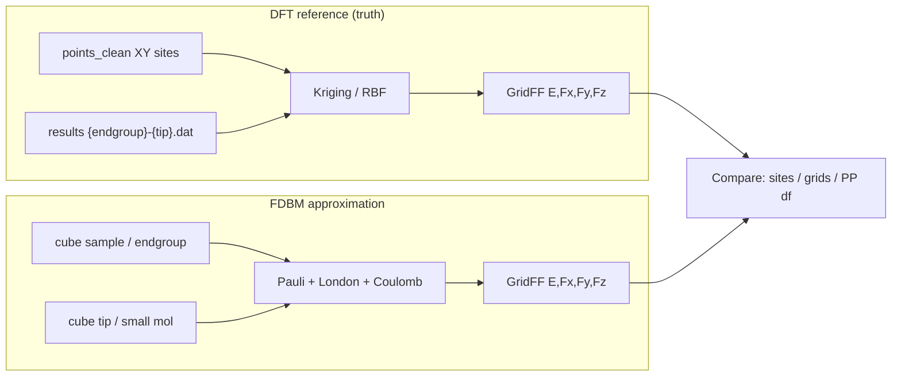

# Kriging DFT GridFF vs FDBM

Presentation / design notes for importing ppafm Kriging/RBF z-scan interpolation into SPAMMM and comparing to FDBM.  
Task: `doc/Tasks/Import_KrigingGridFF.md`. Export SSOT: `/home/prokop/git/ppafm/docs/export/interpolation.export.md`.

---

## Science schema — how the datasets connect



| Role | Naming | Example |
|------|--------|---------|
| **Sample** | Endgroup (CARBSIS base fragment) | `HHO-h-p_1`, `OHO-h_1` |
| **Tip** | Small molecule + orientation | `H2O_O`, `CO_C`, `NH3_H` |
| Scan file | `{endgroup}-{tip}.dat` | `HHO-h-p_1-H2O_O.dat` |

**Comparison levels (planned):**
1. **Z-profiles first** (gate) — `E(z)`, `Fz(z)` at fixed `(x,y)`; contact zoom for Pauli fit  
2. Site–z curves — FDBM vs DFT at same points (no interpolation)  
3. Full GridFF — same XY window only; atoms marked  
4. PP image — only after E/Fz sane  

**Preferred Pauli-fit pair:** `N-h` (pyridine) + `CO_O` — see task §Preferred pair. Probes: **N** and **para-C**.

**2026-07-20 session (investigating):** detailed report in `doc/Tasks/Import_KrigingGridFF.md` §Session report. Headline: cube/Psi4 FDBM shows **large ES repulsion** absent in Kriging *and* in DFTB FDBM → blame **all-electron core − Gaussian NA** on coarse grids (not pyridine physics). Tip clamp inflated CO dipole ~25×. Far-field fake \(p_z\) fixed (GPU project + z-symmetric box). Flat `pyridine.xyz` + DFTB control OK. PP `K_LAT`: CLI now N/m; 0.5 N/m may feel too soft — retune open.

**FDBM physics (current 3 channels used for comparison):**
- **Pauli** — always repulsive: \(E_\mathrm{Pauli}(R) = A[\rho_\mathrm{samp}(r)\,\rho_\mathrm{tip}(r+R)]^\beta\)
- **Coulomb / Hartree** — tip Δρ convolved with sample ESP/Hartree; repulsive (same sign) or attractive (opposite)
- **London / vdW** — \(C_6/r^6\); usually small vs Pauli–Coulomb competition

Fitting target (next after port): optimize \(A_\mathrm{Pauli}\) and \(\beta\) so FDBM matches DFT GridFF / site curves.

**Caveat:** `PAULI_FITTED_DEFAULTS['pyscf_6-31g*']` (A≈39.5, β≈1.15) was fitted with a **Gaussian tip** (σ=0.7 Å), not cube CO/H₂O tips — re-fit per tip with `AFM_utils._fit_pauli_powerlaw` (see `Import_KrigingGridFF.md` §Preferred pair).

**Density sources for FDBM (both, in parallel):**
1. High-quality DFT cubes / grids from **pySCF or GPAW** (Psi4 B3LYP cubes already on disk — see below)
2. **Prolonged DFTB+** via `Grid_dftb` (separate P0 task)

---

## Data map (do not copy — link)

| Dataset | Host path | Symlink in repo |
|---------|-----------|-----------------|
| DFT z-scans + points | `/home/prokop/Desktop/CARBSIS/PEOPLE/Mithun/AFM_Tips/afm_scans/` | `data/mithun_afm_scans` |
| Flat layout + opt-geom | `.../AFM_Tips/afm_scans_flat/` | `data/mithun_afm_scans_flat` |
| Density/ESP cubes (N, N±1) | `/home/prokop/Desktop/CARBSIS/PEOPLE/Mithun/AFM_tip_fukui/` | `data/mithun_afm_tip_fukui` |

### A — Interpolation inputs (`afm_scans/`)

| Path | Role |
|------|------|
| `endgroup_points/` | Raw `*_point_info.txt` |
| `points_clean/` | Clean `type x y` — **already includes outer `grid` points** (~half of HHO sites); no `augment_points_with_grid_8` needed for these |
| `results/` | `{endgroup}-{tip}.dat` z-scans (~143 files) |
| `endgroups/`, `opt-geom/` (flat) | XYZ geometries |
| `volumes/`, `slices/`, `compare_methods/` | Precomputed ppafm interpolants (reference) |

**Z grid (Mithun):** \(z_i = 1.6 + i\cdot 0.1\) Å, \(i=0\ldots44\) → 1.6–6.0 Å.  
**Energy:** likely interaction energy (kcal/mol in files; convert ×0.043364115 → eV). At z≈6 Å mean E is small but not zero — **subtract reference at large separation (e.g. z≈20 Å) before absolute FDBM comparison**. Confirm BSSE vs raw when fitting.

**Demo pair:** `points_clean/HHO-h-p_1_points_clean.txt` + `results/HHO-h-p_1-H2O_O.dat`.

### B — Cubes for FDBM (+ future Fukui)

`AFM_tip_fukui/{neutral,plus_e,minus_e}/<mol>/{Dt,Da,Db,Ds,ESP}.cube`  
Psi4 B3LYP-D3 / cc-pvdz, spacing 0.1 a₀. Covers endgroups **and** tip molecules.

---

## Future: Fukui as 4th GridFF channel (deferred)

**Not the focus now.** Current FDBM / GPU GridFF channels:

| Index | Channel | Role now |
|-------|---------|----------|
| 0 | Pauli | Density-overlap repulsion |
| 1 | London | vdW \(C_6/r^6\) |
| 2 | Coulomb | Hartree / tip–Δρ convolution |
| 3 | Hb (legacy) | H-bond correction slot on `float4` |

**Plan:** replace / redefine channel 3 as **Fukui** proxy for directional H-bond–like correction:

\[
f^\pm(\mathbf r) \propto \rho(N\pm 1)-\rho(N)
\]

from `plus_e` / `minus_e` vs `neutral` cubes → GridFF `float4(Pauli, London, Coulomb, Fukui)`.

Do this **after** Kriging port + Pauli/Coulomb(+London) DFT comparison and \(A,\beta\) fit.

---

## SPAMMM module landing

| Piece | Location |
|-------|----------|
| Wendland / distances | `spammm/SPM/interpy.py` |
| Kriging / RBF | `spammm/SPM/InterpolatorKriging.py`, `InterpolatorRBF.py` |
| z-scan → GridFF pipeline | `spammm/SPM/KrigingGridFF.py` |
| Consumer | `AFMulator.setup_fdbm_grid(F_total, origin, step)` expects **`(nx,ny,nz,4)` = `(Fx,Fy,Fz,E)`** |

External deps for interpolation: **NumPy + SciPy only** (no ppafm `GridUtils` / C++). Matplotlib optional for slice plots.

---

## Scope today vs later

| Now | Later |
|-----|--------|
| Port Kriging → SPAMMM; wire to AFMulator strides | Fit \(A_\mathrm{Pauli},\beta\) vs DFT |
| Side-by-side Kriging DFT vs FDBM-from-cubes | Fukui 4th channel |
| Cube density provider in `AFM_utils` (additive) | pySCF/GPAW live vs prolonged DFTB |

---

## Molecule name matching (cubes ↔ z-scans)

**Rule:** same folder/file stem = same species. Sample = endgroup; tip = small molecule.

| Role | In z-scan name | Cube path `mithun_afm_tip_fukui/neutral/<name>/` | Coverage |
|------|----------------|--------------------------------------------------|----------|
| Sample | `{endgroup}-…` | `Dt.cube`, `ESP.cube`, `geom.xyz` | **12/13** endgroups — missing only `OHO-h_2` |
| Tip | `…-{tip}` | same | **11/11** tips |

**Samples with cubes:** `H-p`, `HHO-h-p_1`, `HN-hh`, `HN-hp_1`, `HN-hp_2`, `HNO-h`, `HNO-p`, `N-h`, `O-h`, `O-p`, `OHO-h_1`, `OO-h`  
**Tips with cubes:** `C2H2`, `CO_C`, `CO_O`, `H2O_H`, `H2O_O`, `HCN_H`, `HCN_N`, `HF_F`, `HF_H`, `NH3_H`, `NH3_N`  
**Demo pair (both sides exist):** `HHO-h-p_1` (sample) + `H2O_O` (tip).

Helper (to add later): `resolve_mithun_pair(endgroup, tip) → {points, zscan, sample_cube_dir, tip_cube_dir, xyz…}` fail loud if any missing.

---

## Plan: modular density provider (cube) — do not break DFTB

### Existing SSOT contract (keep)

All providers in `AFM_utils` already return the same dict shape:

```text
rho_scf, rho_na, rho_diff, V_ES, origin, ngrid, grid_spec  (+ optional extras)
```

Callers: `ModularPipeline`, GUI, `testplot_fdbm_*`. **Do not change their signatures.**

| Provider | Status |
|----------|--------|
| `get_density_from_dftb_dense` | primary GUI path |
| `get_density_from_dftb` / `_plus` | legacy / alt |
| `get_density_from_pyscf` | already modular alt |
| `get_density_from_fireball` | alt |
| **`get_density_from_cube`** | **ADD only** |

### Proposed API (additive)

```python
def get_density_from_cube(cube_dir_or_dt, *, esp_path=None, grid_spec=None,
                          step=None, target_shape=None, roll_tip=False, verbosity=0):
    """Load Psi4/Gaussian Dt (+ optional ESP) → same dict as get_density_from_dftb_dense.
    Resample/pad onto grid_spec if given (FDBM needs sample & tip on same lattice)."""
```

**Reuse (inventory):** `spammm/quantum/DFTB/DFTBplusParser.read_cube` and/or `examples/density_comparison/compare_densities.parse_cube` — prefer one SSOT reader under `spammm/` (extend existing `read_cube`, do not fork). Units: cube Bohr → Å for origin/step; density e/a₀³ → e/ų carefully (× Bohr³/ų).

**Placement:** new function(s) in `AFM_utils.py` near other `get_density_from_*`; thin path resolver in `KrigingGridFF.py` or small helper next to Mithun symlinks. No new top-level package unless needed.

### FDBM field assembly from cubes (physics caveats)

| Channel | Sample | Tip | Notes |
|---------|--------|-----|-------|
| Pauli | `Dt` → `rho_scf` | `Dt` → `rho_tip` (rolled to (0,0,0) like CO tip) | Overlap FFT unchanged |
| Coulomb | Prefer **`ESP.cube`** if present; else Poisson(`rho_diff`) | Tip **Δρ** for conv | Cubes lack `rho_na` |
| London | atom types + positions from `geom.xyz` | — | Same as now |

**Open design choice — `rho_na` / tip Δρ:**

**Decision (USER 2026-07-20):** missing DFT `ρ_NA` is fine. Δρ is mainly for **charge neutrality**.
Use **spherical Gaussians** (σ≈0.5 Å, ppafm-like core) centered **exactly on nuclei** (cube-header
coordinates). Prefer this over “ugly” raw Δρ without cores. Diagnostics: XY plots of ρ_scf / ρ_NA / ρ_diff
with atom markers; assert `∫ρ_diff ≈ 0`.

Implemented: `AFM_utils.make_gaussian_rho_na`, `get_density_from_cube`, `plot_cube_density_diagnostics`.
Also fixed `DFTBplusParser.read_cube` atom lines (`Z charge x y z`).

### Grid alignment (CRITICAL — notorious failure mode)

**Do not compare XY maps until z-profiles overlay.** Full write-up + findings: this section + task `doc/Tasks/Import_KrigingGridFF.md` §CRITICAL.

| Grid | XY | Z meaning |
|------|----|-----------|
| Kriging | `points_clean` frame (= cube atoms ~0.01 Å) | DFT tip height \(z=1.6+i\cdot0.1\) ∈ [1.6, 6.0] Å |
| FDBM | sample bbox **+ ≥4 Å** FFT margin | Sample plane z≈0; tip peak at `(0,0,0)`; field-z = tip height. **Lz ≳ 18 Å** (`z∈[-4,14]`) or wrap ruins high-z |

**Plot rules**

1. Overlay `E(z)`, `Fz(z)` at COM (and O) over full z — script: `tests/SPM/testplot_kriging_vs_fdbm_cube.py` → `z_profiles_*.png`
2. XY only on **intersection** bbox (`GridFF_E_Fz_sameXY.png`); mark COM
3. `--z_offset`: `z_Krig ≈ z_FDBM + Δz`; auto-corr Δz is unreliable when amplitudes differ hugely
4. Subtract large-z `E_ref` (~10 Å FDBM; last Kriging z) before absolute compare
5. No PP OutFz until profiles + same-XY E/Fz look sane

**Bugs already hit (2026-07-20, HHO+H2O_O)**

- Short FFT z-box (~8 Å) → tip wraps → fake Pauli/ES at “high” z  
- Side-by-side plots with **different XY extents** → false morphology mismatch  
- Comparing AFM heights before confirming z-label identity → meaningless residuals  

**Status after alignment pass:** geometric frames look consistent within ~0.5 Å at COM (walls in same region). Remaining mismatch at AFM z is **physics** (FDBM ES/Gaussian NA stays repulsive; Kriging has attractive well) — not a multi-Å grid mislabel. USER review of `debug/testplot_kriging_vs_fdbm_cube/z_profiles_*.png` required before treating compare as valid.

### Side-by-side comparison harness

Script: `tests/SPM/testplot_kriging_vs_fdbm_cube.py` (alignment-first)

```text
z_profiles_overlay / zoom     — gate for any further compare
same-XY E/Fz + FDBM channels  — only after z looks right
(OutFz deferred until E/Fz sane)
```

**z-range:** Kriging fixed 1.6–6.0; FDBM taller for FFT; compare only where both defined and wrap-safe.

### Implementation order (after USER OK)

1. ~~Document + molecule resolver~~ / cube NA diagnostics  
2. ~~`get_density_from_cube` + Gaussian ρ_NA~~  
3. ~~FDBM compose from cubes + alignment-first compare~~ (`testplot_kriging_vs_fdbm_cube.py`)  
4. **Next:** USER confirms z-profiles; then ES/NA (ESP.cube); then \(A,\beta\) fit  
5. Fukui 4th channel later  

### Comparison runs (HHO-h-p_1 + H2O_O, 2026-07-20)

Artifacts: `debug/testplot_kriging_vs_fdbm_cube/` — status **investigating** (not Done).

| Observation | Implication |
|-------------|-------------|
| Short z-box → wrap | Tall grid required (`Lz≳18 Å`); fail if Lz<12 Å |
| XY atoms match points_clean | Same lab frame; plot intersection only |
| z-profiles Δz=0 at COM | Walls same region; not multi-Å misalignment |
| AFM zoom: Kriging attractive, FDBM ES+ | Channel/NA/sign — next physics fix |
| `corr(V_fft, ESP)≈−0.87` (r>1.5 Å) | Valence Poisson sign opposite ESP; E_ES OK if tip Δρ consistent |
| Soft Gaussian NA → core Δρ spikes | Prefer ESP.cube / better NA for ES |

**Caveats:** planar tips (H2O_*) reoriented apex-down; CO/HF already z-aligned left as-is. 

### Non-goals this step

- Do not replace DFTB default in GUI  
- Do not wire Fukui N±1 yet  
- Do not copy cube data into repo (symlink only)
