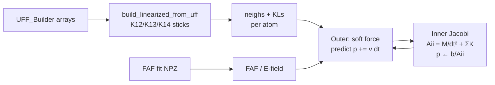

# LFF — Linearized Force-Field Projective Relaxation

## Summary

**LFF** is the third GPU relax path beside UFF and SPFF. Hard intramolecular geometry is replaced by a spring network (K₁₂ bonds, K₁₃ angles, K₁₄ dihedrals) and solved with **diagonal projective Jacobi** stabilized by \(M/dt^2\). Soft forces (FAF substrate, optional E-field) drive a large outer timestep. That split lets adsorbate relaxation reach SPFF-like O-bend on PTCDA/NaCl in **~50 outer steps** (~0.004 s) instead of thousands of explicit MD steps.



## Tutorial

```bash
# PTCDA + FAF: topology plot + LFF/UFF/SPFF comparison + outer sweep
PYOPENCL_CTX=0 pytest tests/test_relax_ptcda_faf.py --develop -s
# REVIEW: debug/test_relax_ptcda_faf/lff_topology.png
# REVIEW: debug/test_relax_ptcda_faf/lff_outer_sweep.out
# REVIEW: debug/test_relax_ptcda_faf/lff_faf_geometry.png
```

Library snippet:

```python
from spammm.forcefields.UFF_cl import UFF_cl
from spammm.forcefields.LFFSolver import LFFSolver

uff = UFF_cl(bPrint=False)
uff_data = uff.toUFF(mol)
lff = LFFSolver(bPrint=False)
lff.from_uff(uff_data, mol=mol, mass=1.0)   # uniform mass for relax
lff.upload_folded_fit(fit)                 # optional FAF
lff.relax(n_outer=50, n_inner=16, dt=0.04, damp=0.9, do_faf=True)
apos = lff.get_positions()
```

Via controller: `FFController(ff_type='lff').build_ff(mol)`.

### Fit knobs

| Knob | Typical | Role |
|------|---------|------|
| `n_outer` | 50–200 | Soft + Jacobi cycles; **50 ≈ SPFF dOCdz** on PTCDA+FAF |
| `n_inner` | 8–16 | Jacobi iterations per outer (spring convergence) |
| `dt` | 0.04–0.05 | Outer soft-force step (larger than explicit MD) |
| `damp` | 0.9 | Velocity damping each outer |
| `bMix` | 0 | Heavy-ball; optional, often 0 |
| `mass` | **1.0** | Uniform; do not use elemental masses for relax |
| `include_dihedrals` | True | K₁₄; rest length from current geometry |
| `MAX_NEIGHBORS` | 24 | Packing cap (PTCDA max degree ~18) |
| `LFF_WG_SIZE` | 64 | One molecule ≤ 64 atoms per workgroup |

## Physics

### Why not “mass scaling”?

Soft FAF and hard bonds act on the **same** atoms. Inflating mass for stiff modes also slows soft motion. LFF instead treats stiff terms as **constraints/springs** projected each step, so soft forces can take a large `dt` without bond collapse.

### Spring classes (from UFF)

| Class | Graph | Source | \(l_0\) | \(K\) |
|-------|-------|--------|---------|-------|
| **K₁₂** | 1–2 | `bonParams` | UFF \(r_0\) | UFF bond \(k\) |
| **K₁₃** | 1–3 (angle ends) | `angAtoms` + Fourier coeffs → \(\theta_0\) | law of cosines | Fourier \(k\) × ~8, clipped |
| **K₁₄** | 1–4 (dihedral ends) | `dihAtoms` | **current** \|a−d\| (preserve PAH shape) | \(\mathrm{clip}(40V, 5, 80)\) |

**Landmine:** mapping torsion \(V\) via \(K_r = V/(dl/d\phi)^2\) blows up when \(dl\approx 0\) (K~10⁶) and crumples the molecule. Always use capped \(K\) + geometry-based \(l_0\).

### Outer / inner loop (`lff_jacobi`)

1. Soft force \(F\) (E-field × Q, optional FAF gradient).
2. Predict: \(v \leftarrow \mathrm{damp}\,v + F\,dt/m\); \(p \leftarrow p + v\,dt\).
3. For each Jacobi iter:  
   \(b_i = (M_i/dt^2)\,p_i + \sum_j K_{ij}\,p^{\mathrm{rest}}_{ij}\),  
   \(A_{ii} = M_i/dt^2 + \sum_j K_{ij}\),  
   \(p_i \leftarrow b_i/A_{ii}\) (local diagonal PD).
4. \(v \leftarrow (p - p_{\mathrm{old}})/dt\).

One OpenCL workgroup = one molecule (`LFF_WG_SIZE`); threads beyond `natoms` gate work but hit barriers.

## API reference

| Symbol | Role |
|--------|------|
| `LFFSolver` | OpenCL host; `from_uff`, `upload_folded_fit`, `relax`, `run_jacobi` |
| `build_linearized_from_uff` | UFF dict → `neighs`, `KLs`, stick list for plots |
| `lff_jacobi` | Main kernel (springs + optional FAF) |
| `lff_nb_jacobi` | Legacy NB variant (FireCore parity; adsorbates prefer FAF) |
| `FFController(ff_type='lff')` | Thin build path |

## Parity / benchmarks

| Check | Result | Artifact |
|-------|--------|----------|
| Vacuum LFF planarity | ~0 after 100 outer | ad-hoc / vacuum path |
| PTCDA+FAF vs SPFF | nOuter=50 → dOCdz≈−0.62 (SPFF −0.63) | `lff_outer_sweep.out` |
| Wall time | LFF 50×16 ≈ 0.004 s vs SPFF 8000 ≈ 0.07 s | `speed_summary.out` |
| No lateral crumple | `spanx > 8` assert | `test_relax_ptcda_faf.py` |
| UFF/SPFF regression | `test_relax_serial` 6 passed | — |

**Not** energy-parity with UFF/SPFF — LFF is a **surrogate** for fast GUI / adsorbate morphing. Use fused UFF/SPFF for FF SSOT.

## Implementations (cross-repo)

| Language | Location | Status | Notes |
|----------|----------|--------|-------|
| OpenCL | `kernels/LFF.cl` | active | SPAMMM; FAF outer |
| Python | `spammm/forcefields/LFFSolver.py` | active | UFF→springs |
| OpenCL | FireCore `cpp/common_resources/cl/LFF.cl` | experimental | ancestor; no FAF |
| JS | FireCore `MMFFLTopology.js` | active | K₁₂/K₁₃/K₁₄ builder (fuller K₁₄) |
| WebGPU | FireCore XPDB / PD | related | same spring idea |

## Open issues

- [ ] Energy accumulator in LFF kernel (GUI energy display)
- [ ] GUI combo for `ff_type='lff'` (controller path exists)
- [ ] Default `nOuter≈50` for SPFF-like bend vs stronger 200
- [ ] Molecules > 64 atoms → multi-WG or global path
- [ ] Molecule–molecule NB in fused LFF (optional)
- [ ] Port JS equilibrium K₁₄ \(l_0\) instead of current-geometry when UFF typing is trusted

## Pitfalls

- Uniform **mass=1** for relax; elemental masses hurt soft/hard mix.
- Never enable raw \(V/(dl)^2\) K₁₄ without caps.
- FAF charges currently strong (“over-did”); dial back separately from LFF.
- FireCore `MAX_NEIGHBORS=8` too small for PAH K₁₂+K₁₃+K₁₄ — SPAMMM uses 24.

## Related docs

- Perf / session log: [`doc/Tasks/PerfBenchmark_Relaxation.md`](../Tasks/PerfBenchmark_Relaxation.md)
- FAF substrate: `spammm/surfaces/FoldedRigid.py`, `doc/surface_interactions.md`
- Agent index: [`doc/ToDo/ToDo.agents.md`](../ToDo/ToDo.agents.md)
